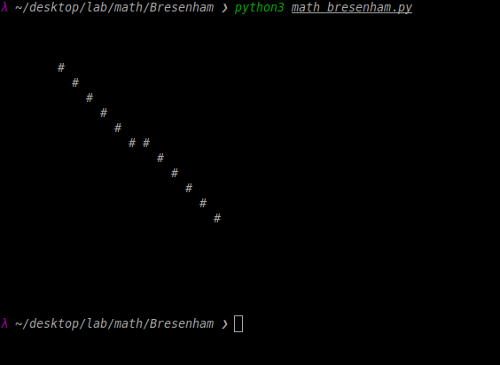

# Algoritmo de Bresenham
Este repositório demonstra a aplicação do algoritmo de Bresenham na prática, utilizando Python para a demonstração.
O algoritmo de Bresenham é usado para desenhar linhas em uma grade de pixels (ou matriz), determinando de forma eficiente as coordenadas que devem ser marcadas para formar uma linha entre dois pontos.

